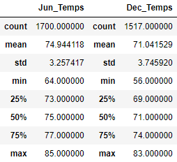
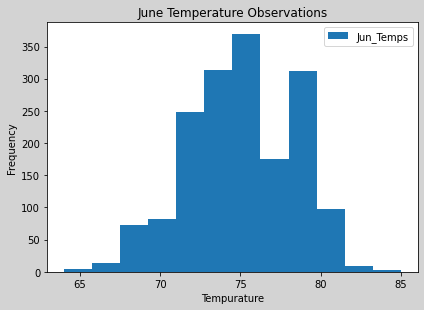
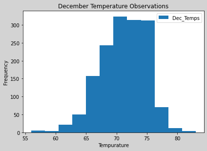

# Climate Analysis

## Overview:
### Purpose:
Analyzing weather trends in Oahu, Hawaii to determine whether a 'Surf & Ice Cream' shop would be sustainable year-round.

## Results:

1. The main difference between June vs December data is that the average temperature in June is approx 5 degrees higher than it is in December. This is to be expected as Summer months typically are warmer than Winter. The standard deviation in the June data is 3.3 vs 3.7 in December, indicating that the temperatures are (slightly) more consistent in the Summer.

2. The lowest temperature observed in June (64F) is approx 8 degrees higher than the lowest temperature observed in December (56F). This is also to be expected as the weather is generally warmer in the Summer. 

3. The highest temperature observed in June (85F) is only 2 degrees higher than the highest temperature observed in December (83F). This a great data point to support the year-round sustainability of a Surf & Ice Cream shop.

## Summary:
In summary, Oahu appears to be a great place to open a Surf & Ice Cream shop, as the data seems to indicate that it is generally 'warm' throughout both Summer and Winter months.

### Further Analysis
Two additional queries we could perform to further support our conclusion include:
1. We could query the precipitation data to see whether there are any times during the year that are more likely to experience rainfall.
2. We could limit our queries to weather stations that are at lower elevations. As our Surf & Ice Cream shop is expected to be opened at sea level, we're more interested in weather patterns at (or close to) 0 elevation.
